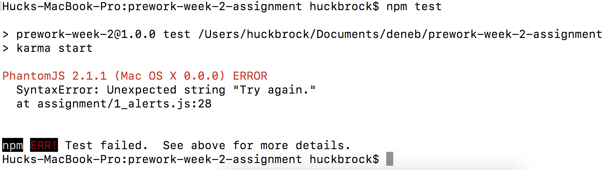
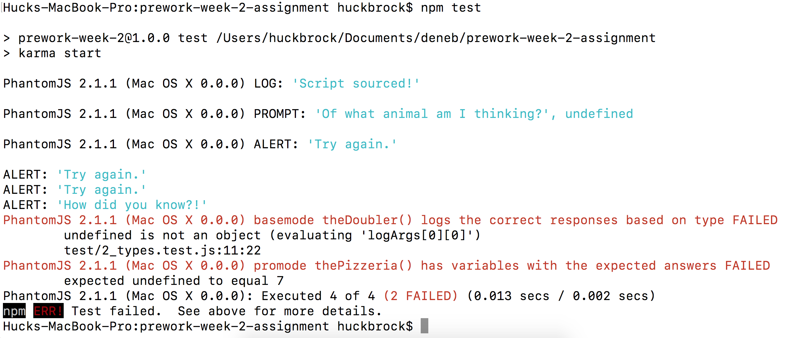
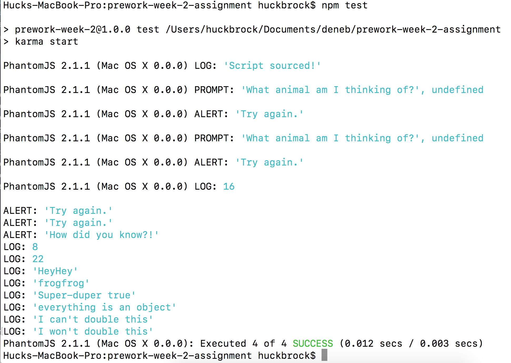

# Installing and Running Node
You should only have to install Homebrew and Node once in your time at Prime. Follow the instructions below.

## Installing Homebrew and Node.js (one-time)
1. [Install Homebrew](http://brew.sh/). This will be done on the command line (Terminal). Paste the command under from the Homebrew site into the terminal.
2. When asked for a password, enter the password to log into your computer. Note: The screen won't change as you type.
2. Once Homebrew is installed, run the command: `brew install node`
3. When this is complete, run this at your Terminal: `node --version` If you see a number, you are good to go!

## Install the dependencies for the assignemnt.
1. Navigate into the assignment directory, eg: `prework-week-2-assignment`.
2. Then run the command `npm install` in the terminal. "npm" stands for "node package manager". This will install all the needed packages for the tests to work in that directory. 

## Run the tests
1. Use the command `npm test` in the assignment directory
2. The tests will show up in the terminal. The terminal will focus on the tests that fail. They will probably have some text in red. The text will be very similiar to the test on the Testing App. 

# Reading the Tests

Each time you run `npm test`, the tests will run. 

---

### Here's screenshot of what the tests show if there is a syntax error that is preventing the tests from running. In this case, it gives a hint: `assignment/3_scope.js:18`. So I'll start looking for that error on line 18 of `3_scope.js`.

---

### Some tests passing, some tests failing. It says it ran all the tests and 2 of them failed: `Executed 4 of 4 (2 FAILED)`. In red, it describes the tests that failed. 

---

### Finally, here's a screenshot of all the tests passing. `Executed 4 of 4 SUCCESS `!

